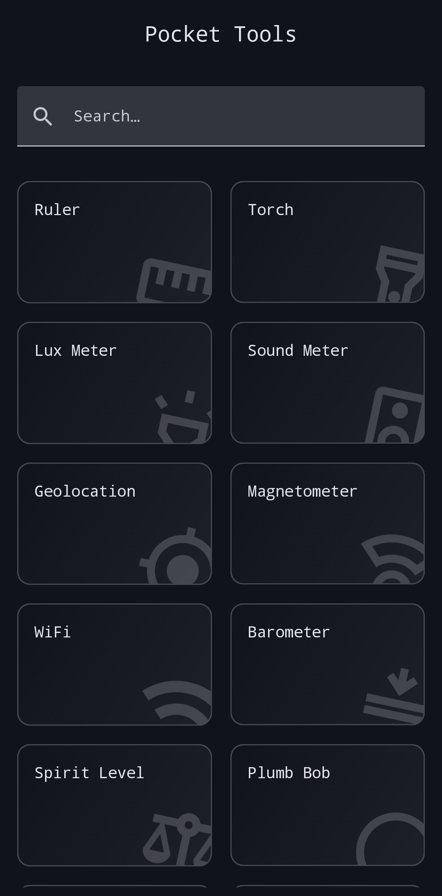
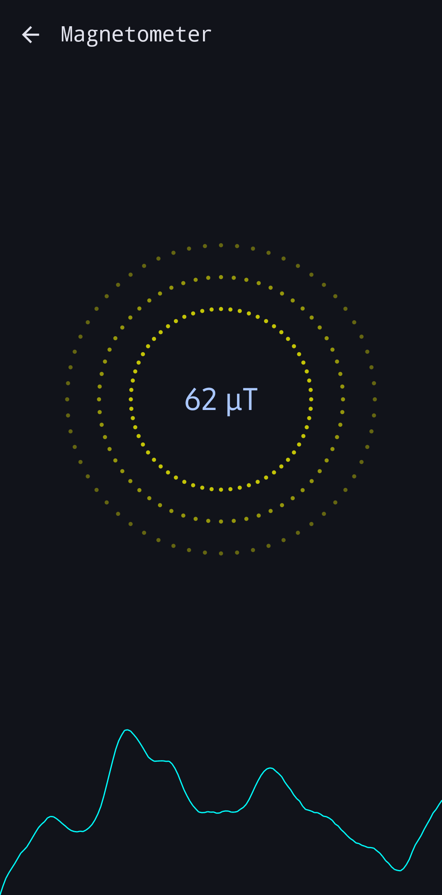
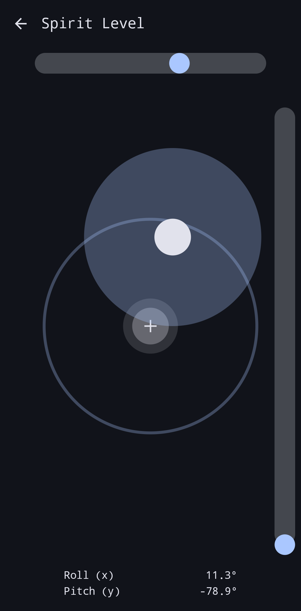

# Android Pocket Tools

<div align="center">


</div>

A collection of various tools and utilities on Android.






## Objectives

- Learn Native Android Development using Kotlin and Jetpack Compose
- Build a collection of useful tools and utilities that come in handy in everyday life, especially as a stand-in substitute of proper tools.

## Technology Stack

- **Language:** Kotlin
- **UI:** Jetpack Compose
- **Navigation:** Jetpack Navigation for Compose
- **Core Libraries:** AndroidX and Material 3

## Features

The app contains several utility screens, including:

- Barometer
- Counter
- Flashlight (Torch)
- Geolocation
- Luxmeter
- Magnetometer
- Plumb Bob
- Ruler
- Sound (Decibel)
- Spirit Level
- Tip Calculator
- WiFi

---

## Installation/Setup Guide

To get a local copy up and running, follow these simple steps.

### Prerequisites

- Android Studio
- Android SDK configured (API Level 31+)
- Git

### Installation

1.  Clone the repo
    ```bash
    git clone https://github.com/shresht7/PocketTools.git
    ```
2.  Open the project in Android Studio.
3.  Build and run the app on an emulator or a physical device.

---

## License

The project is licensed under the [MIT License](./LICENSE)
